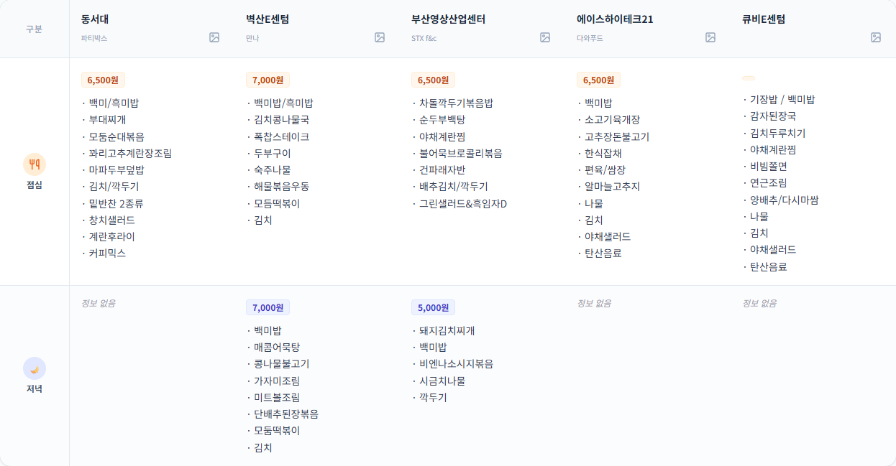

👋 좋은 아침입니다, 센텀 직장인 여러분!

## 🍴 오늘의 센텀 점심 식단표 (1월 8일)

---

## 💪 활기찬 하루를 위한 응원 한마디

행복한 목요일 점심시간입니다! 🍽️ 주말을 앞두고 맛있는 점심으로 에너지를 충전해보세요. 😋

---

## 📰 오늘의 주요 뉴스 요약

바쁜 직장인분들을 위해 핵심 뉴스만 골라왔습니다.

### 🏢 [부산/지역 소식]
**1. 클래식부산 '비엔나 뉴 이어 위크' 개최**
'비엔나 뉴 이어 위크'가 부산에서 개최됩니다. 클래식을 사랑하는 팬들에게 신년 분위기를 물씬 느낄 수 있는 기회를 제공하죠. 이번 주말, 감미로운 음악에 빠져보세요! 🎻

**2. 부산 청년의 '세계디자인수도 부산' 프로젝트, 서울영상광고제 금상 수상**
부산 청년이 '세계디자인수도 부산' 프로젝트로 금상을 수상했습니다. 부산이 세계적인 디자인 도시로 자리 잡을 가능성을 보여주는 멋진 성과네요! 🏆

**3. 북극항로 선점을 위한 부산의 새로운 전략**
부산이 석유저장시설을 종합보세구역으로 지정하며 북극항로 선점을 위한 발걸음을 내딛습니다. 이는 부산의 해양물류 허브로서의 위상을 높이는 데 기여할 전망입니다. 🚢

### 🌏 [전국/경제 이슈]
**1. 내일 아침 -10도 '뚝'...한파특보 발효**
내일 아침 서울 등 일부 지역에 -10도까지 떨어지는 한파가 예고되었습니다. 한파특보 발효 중이니, 따뜻하게 입고 출근하세요! 🧥🧣

**2. 창고형 약국 증가, 동네 약국 위기**
창고형 약국이 증가하며 동네 약국들이 점차 어려움을 겪고 있습니다. 편리함과 가격 경쟁력이 장점이지만, 지역 약국의 생존 문제는 큰 고민으로 떠오르고 있죠. 💊

**3. 심전도로 폐질환 진단, AI 신기술 주목**
심전도만으로 폐질환을 진단할 수 있는 놀라운 AI 기술이 개발되었습니다. 의료 혁신이 일상에 어떤 영향을 미칠지 기대됩니다. 🤖

---

## 🗣️ 오늘의 스몰토크 주제 (3가지)

식사 시간에 가볍게 꺼내기 좋은 주제들입니다.

**1️⃣ 부산의 해양 물류 허브로서의 역할**
: 부산이 북극항로를 선점하면 해양물류 허브로서의 위상을 더욱 강화할 텐데, 앞으로 어떤 발전이 있을지 기대되네요. 🌊

**2️⃣ 한파 대비 이야기**
: 이번 주말은 가족들과 따뜻한 국물 요리를 즐기며 한파를 이겨내보세요! 🍲

**3️⃣ AI 기술의 발전과 일상 변화**
: AI 기술이 의료 분야에서도 빠르게 발전하고 있는데, 앞으로 우리가 누릴 혜택은 무엇일까요? 🤔

---

맛있는 점심 드시고 오후 업무도 화이팅하세요! 💪

**센텀밥집** - 뉴스와 식단을 한 번에 전해드립니다.
🔗 [https://aoperat.github.io/centumbob](https://aoperat.github.io/centumbob)
